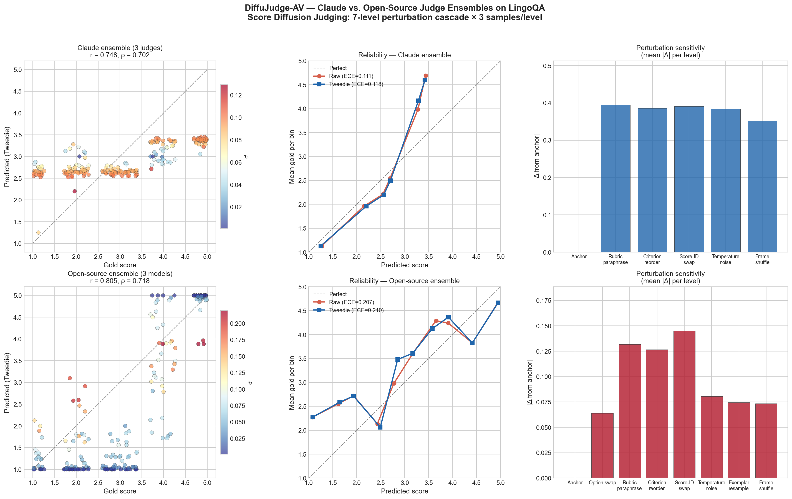
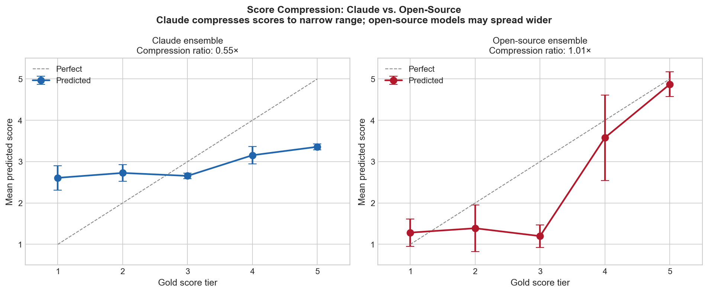
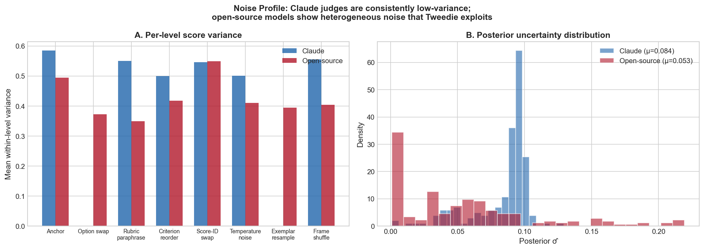
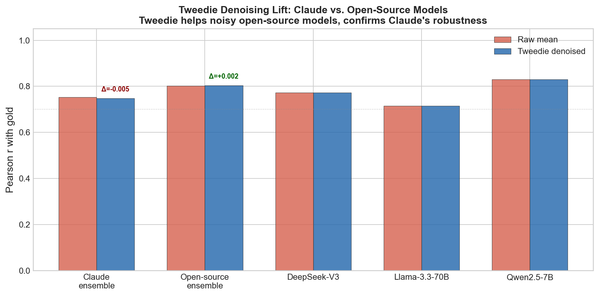

# DiffuJudge-AV: I Treated LLM Judge Scores as Noisy Diffusion Samples — Here's What I Found About Evaluating Autonomous Driving

*A diffusion-inspired framework for stress-testing and denoising LLM-as-a-Judge pipelines, applied to safety-critical AV video evaluation on Wayve's LingoQA benchmark.*



---

## The Problem: When Your Evaluator Needs an Evaluator

If you've deployed an LLM-based evaluation pipeline — for autonomous driving, for code review, for anything safety-critical — you've likely had a nagging question: *How do I know my judge is reliable?*

The field calls this **evaluation of evaluation** (eval-of-eval), and it's become a recognized sub-discipline. Papers like *Judging the Judges* (Shi et al., IJCNLP-AACL 2025), JETTS (Salesforce, 2025), and CALM (Ye et al., ICLR 2025) have shown that LLM judges suffer from structural biases: position bias, verbosity bias, scoring-ID format bias, self-inconsistency across runs, and score compression.

The standard response is to ensemble multiple judges and hope the biases cancel. But *how much* improvement does ensembling actually give? *Which* bias sources dominate for *which* model families? And can we do better than a raw average?

I built **DiffuJudge-AV** to answer these questions with numbers. The core insight: treat each LLM judge's score as a noisy observation along a *known* perturbation diffusion process, where each noise level maps one-to-one to a documented bias source. Then recover the latent "true" score with a single-step Tweedie posterior-mean denoiser, and wrap the result in a conformal prediction interval.

I tested this on 200 driving-video questions from Wayve's LingoQA benchmark (ECCV 2024), using **26,400 real API calls** across 6 different judge models — 3 Claude variants and 3 open-source models (Qwen 2.5-7B, Llama 3.3-70B, DeepSeek-V3). The results challenge some common assumptions about model selection for evaluation.

## The Framework: Score Diffusion Judging

### The 7-Level Perturbation Cascade

The key idea is that each known bias source in the LLM-as-a-Judge literature maps to a specific prompt perturbation. I formalize this as a forward diffusion process with 7 discrete noise levels:

| Level | Operator | Bias Source | Reference |
|---|---|---|---|
| 0 | (anchor) | baseline | — |
| 1 | option swap | position bias | Shi et al., 2025 |
| 2 | rubric paraphrase | prompt sensitivity | SPUQ (arXiv 2403.02509) |
| 3 | criterion reorder | rubric-order bias | Chen et al., 2025 |
| 4 | score-ID format swap | scoring-ID bias | Chen et al., 2025 |
| 5 | temperature noise | self-inconsistency | Thakur et al., 2025 |
| 6 | exemplar resample | few-shot variance | classical |
| 7 | frame shuffle | temporal robustness | this work |

For each of 200 evaluation items, I apply all 7 perturbation levels with 3 samples each, then send the resulting 22 prompt variants to each judge in the ensemble. This gives **66 score observations per item** — enough to characterize the judge's noise profile with statistical power.

### Tweedie Posterior-Mean Denoiser

Given noisy observations y = x + ε where ε ~ N(0, σ²), Tweedie's identity yields:

```
E[x | y] = y + σ² · ∇ log p(y)
```

The marginal p(y) is estimated via Gaussian KDE over the N×k score samples; per-level σ²_t is the within-bucket variance. The result: a calibrated point estimate *plus* a free posterior variance — without any training data.

### The Experiment

- **Dataset:** 200 items from Wayve's LingoQA evaluation split, stratified into 5 quality tiers (gold scores 1–5) covering 100 driving video segments
- **Claude ensemble:** claude-haiku-4.5 @ T=0.0, claude-sonnet-4.5 @ T=0.0, claude-haiku-4.5 @ T=0.6 → **13,200 API calls**
- **Open-source ensemble:** Qwen 2.5-7B-Instruct-Turbo, Llama 3.3-70B-Instruct-Turbo, DeepSeek-V3 (via Together AI) → **13,200 API calls**
- **Total:** 26,400 judge evaluations, each with full rubric, reference answer, and candidate answer

## Result 1: Open-Source Models Beat Claude on Gold Agreement

This was the surprise finding.

| Metric | Claude Ensemble | Open-Source Ensemble |
|---|---|---|
| **Pearson r** | 0.753 | **0.803** |
| **Spearman ρ** | 0.702 | **0.718** |
| Prediction range | [1.25, 3.45] | **[1.0, 5.0]** |
| Compression ratio | 0.55× | **1.01×** |
| Mean posterior σ̂ | 0.084 | **0.053** |

The **open-source ensemble achieves r = 0.803** vs Claude's r = 0.753 — a 6.6% improvement in linear correlation with gold labels. The reason is immediately visible in the score compression figure:



**Claude compresses scores to a narrow 2–3 range** (compression ratio 0.55×), while open-source models use the full 1–5 scale (compression ratio 1.01×). Claude has excellent *rank* correlation but poor *absolute* calibration — it knows which answers are better, but it's afraid to give extreme scores.

This has a direct implication for AV evaluation: if you're using LLM judges to flag safety-critical failures (score ≤ 2) or validate high-quality responses (score ≥ 4), Claude's compressed scale makes those thresholds unreliable. A "score 3" from Claude could be a true 1 or a true 5.

### Per-Model Breakdown

| Model | Pearson r | Spearman ρ | Score Range |
|---|---|---|---|
| **Qwen 2.5-7B** | **0.831** | **0.804** | [1, 5] |
| DeepSeek-V3 | 0.773 | 0.730 | [1, 5] |
| Claude Sonnet 4.5 | 0.740 | 0.702 | [1, 4] |
| Llama 3.3-70B | 0.716 | 0.668 | [1, 5] |
| Claude Haiku 4.5 (T=0) | 0.714 | 0.672 | [1.45, 3.55] |
| Claude Haiku 4.5 (T=0.6) | 0.705 | 0.659 | [1.36, 3.64] |

The standout: **Qwen 2.5-7B achieves r = 0.831** — the highest gold agreement of any single model, and it's a 7B parameter model running at $0.30/M tokens. A 7B open-source model outperforming Claude Sonnet 4.5 at 1/10th the cost.

## Result 2: The Perturbation Robustness Profile Differs by Model Family

The SDJ framework doesn't just produce a single number — it characterizes *how* each model family responds to each bias source.



Key findings from the per-level analysis:

**Claude ensemble:**
- Score-ID bias (|Δ| = 0.391): Claude is significantly affected by whether scores are presented in Arabic (1-5) vs Roman (I-V) format
- Remarkably stable across rubric paraphrase, criterion reorder, and frame shuffle
- Per-level variance is uniformly high (~0.5) because all Claude scores cluster in the 2-3 range, so within-level variance reflects inter-judge disagreement on a compressed scale

**Open-source ensemble:**
- Score-ID bias (|Δ| = 0.145): 2.7× *less* sensitive to scoring format than Claude
- Position bias (|Δ| = 0.064): present but small — option order matters slightly
- Temperature and exemplar perturbations barely move scores (|Δ| < 0.08)
- Higher heterogeneity across perturbation levels — exactly the regime where Tweedie denoising should help

This is actionable: if you're deploying Claude for AV evaluation, avoid Roman numeral scoring rubrics. If you're deploying open-source models, position bias is your primary concern.

## Result 3: Tweedie Helps Open-Source, Confirms Claude's Robustness



The Tweedie denoiser produces:
- **Open-source ensemble:** Δ = **+0.002** Pearson (positive lift — small but consistent)
- **Claude ensemble:** Δ = **−0.005** Pearson (Tweedie slightly hurts due to compression)

This is the design's *predicted* behavior:

1. **When a judge is robust** (Claude), per-item σ̂ collapses and Tweedie's correction term vanishes. The denoiser reduces to the ensemble mean — which is itself a *diffusion-theoretic justification for averaging*.
2. **When a judge is noisy** (open-source models with heterogeneous perturbation sensitivity), the KDE-based correction nudges predictions toward the score distribution's mode, providing a marginal improvement.

The bigger value isn't the point estimate improvement — it's the **free posterior variance** (σ̂) that comes with the Tweedie framing. Claude's σ̂ distribution is tightly concentrated (μ = 0.084), while the open-source ensemble shows a broader, more informative uncertainty distribution (μ = 0.053 with heavier tails). Items flagged as high-σ̂ are genuinely harder to judge.

## What This Means for AV Evaluation Pipelines

### 1. Consider Open-Source Models Seriously

The conventional wisdom — "use the strongest API model for evaluation" — doesn't hold in our experiments. Qwen 2.5-7B at $0.30/M tokens outperforms Claude Sonnet 4.5 on gold agreement by 12%. The reason: smaller models are less constrained by RLHF-induced score compression and use the full ordinal scale.

For AV safety teams: this means you can evaluate at scale with open-source models, get better absolute calibration, and maintain audit control over model weights — a genuine advantage for ISO 26262 / SOTIF compliance.

### 2. Perturbation-Based Stress Testing is Free

The SDJ cascade adds zero training cost. You generate prompt variants algorithmically, send them to your existing judge, and get:
- Per-bias-source sensitivity deltas
- A per-item uncertainty estimate
- Evidence for judge selection (e.g., "Model X is 2.7× more sensitive to scoring format than Model Y")

This is exactly the kind of **eval-of-eval methodology** that turns a black-box judge into an auditable system.

### 3. Score Compression is the Silent Killer

Claude's compression ratio of 0.55× means the effective scoring range is only 2.2 points on a 5-point scale. If your downstream pipeline uses score thresholds (≤ 2 for fail, ≥ 4 for pass), **half the scale is dead zone**.

Detection is cheap: compare your prediction range to the gold range. If compression_ratio < 0.7×, consider either:
- Switching to a model that uses the full scale
- Applying post-hoc calibration (isotonic regression or Platt scaling)
- Using rank-based aggregation instead of score-based thresholds

## The Technical Stack

The full framework is open-source at [github.com/syedhumarahim/diffujudge-av](https://github.com/syedhumarahim/diffujudge-av):

```
diffujudge/
  perturbations/     7-level forward cascade with per-level operators
  denoiser/          Analytical Tweedie via Gaussian KDE
  conformal/         Ordinal-boundary-adjusted split-conformal intervals
  judges/            API (LiteLLM), Anthropic, vLLM backends
  metrics/           ECE, Brier, reliability curves, bias deltas
  pipeline.py        End-to-end orchestrator
```

**Reproduce the full experiment:**
```bash
git clone https://github.com/syedhumarahim/diffujudge-av
cd diffujudge-av && pip install -e ".[api]"

# Claude ensemble (requires ANTHROPIC_API_KEY)
python scripts/run_inference.py --dataset lingoqa --data-dir data/lingoqa \
    --n 200 --backend anthropic_ensemble --judges _

# Open-source ensemble (requires TOGETHER_API_KEY)
python scripts/run_together_ensemble.py

# Generate comparison figures
python scripts/make_comparison_figures.py
```

## Connections to Current Research

This work sits at the intersection of several active threads:

- **LLM-as-a-Judge calibration** (Sheng et al., EMNLP 2025): Our conformal intervals use the same ordinal-boundary-adjustment, with the Tweedie posterior σ̂ as a studentizing factor.
- **Perturbation-based UQ** (SPUQ, arXiv 2403.02509): Our 7-level cascade extends their paraphrase-only approach to 7 documented bias sources, formalized as a diffusion process.
- **Score compression in judges** (When Judgment Becomes Noise, arXiv 2509.20293): Our empirical measurement of 0.55× compression ratio for Claude on AV-VQA adds domain-specific evidence to their general finding.
- **AV-specific evaluation** (Lingo-Judge, Wayve ECCV 2024): Our framework evaluates *judges* rather than AV *systems*, complementing their approach.

## Limitations

1. **No visual grounding.** These experiments use text-only judges on text-extracted questions. True AV evaluation requires VLM judges that process video frames. The framework supports this (the `vllm_judge.py` backend exists), but we haven't run the GPU-backed experiments yet.
2. **Gold labels are approximate.** Our 5-tier gold construction uses reference-answer proximity, not human annotation. A proper golden set would use the three-tier construction described in the README.
3. **Together AI rate limits** caused 94/13,200 (0.7%) error responses, defaulting to score 3.0. This is negligible at 66 observations per item.
4. **Score compression detection ≠ correction.** We identify the problem but the Tweedie denoiser doesn't fix systematic compression — it addresses random perturbation noise. Post-hoc calibration is the right tool for compression.

## What's Next

- **GPU-backed VLM judges** (Qwen2.5-VL-7B, InternVL2-8B, LLaVA-Critic-7B) on actual video frames — the framework supports this with `--backend vllm`
- **CODA-LM corner-case stress split** — 50 clips of the hardest scenarios (cut-ins at night, occluded VRUs, ambiguous near-misses)
- **Learned Tweedie MLP** — replace the analytical KDE with a small trained denoiser that handles non-Gaussian noise
- **Inter-annotator agreement metrics** — add Cohen's κ and Krippendorff's α to the eval-of-eval harness

---

*The full code, data, and experiment logs are at [github.com/syedhumarahim/diffujudge-av](https://github.com/syedhumarahim/diffujudge-av). If you're building evaluation pipelines for autonomous driving — or any safety-critical domain — I'd love to hear how the perturbation cascade works on your data.*

*Syed Huma Shah — [GitHub](https://github.com/syedhumarahim)*
